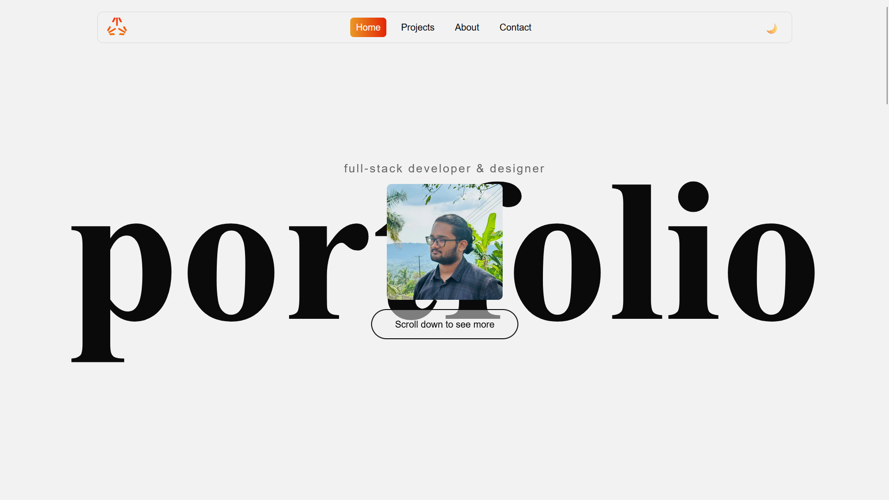

# Personal Portfolio

A personal portfolio website built with Next.js, showcasing my projects, contributions, and contact information.

🌐 **Live Site:** [dericjojo.vercel.app](https://nextjs-boilerplate-drab-two-50.vercel.app/)



---

## Features

- GitHub contribution graph pulled live from the GitHub GraphQL API
- Scroll-based blur animation on the hero section
- Dark/light mode toggle
- Pages for About, Projects, and Contact
- Responsive layout

## Tech Stack

- [Next.js](https://nextjs.org/) — React framework with App Router
- TypeScript — type-safe components
- CSS Modules — scoped styling
- GitHub GraphQL API — live contribution data
- Vercel — deployment

## Getting Started

Clone the repo and install dependencies:

```bash
git clone https://github.com/JackitudilinksG/jackitudilinksg.github.io.git
cd jackitudilinksg.github.io
npm install
```

Create a `.env.local` file in the root with the following:

```
GITHUB_TOKEN=your_github_token
GITHUB_USERNAME=your_github_username
```

> Your GitHub token needs the `read:user` scope. Generate one at GitHub → Settings → Developer Settings → Personal Access Tokens.

Run the development server:

```bash
npm run dev
```

Open [http://localhost:3000](http://localhost:3000) to view it in the browser.

## Project Structure

```
src/app/
├── api/
│   └── contributions/   # GitHub GraphQL API route
├── components/          # Shared components (Navbar, Footer, etc.)
├── styles/              # CSS Modules
├── about/               # /about page
├── projects/            # /projects page
├── contact/             # /contact page
└── page.tsx             # Home / Hero page
```

## Deployment

Deployed on [Vercel](https://vercel.com). Environment variables (`GITHUB_TOKEN`, `GITHUB_USERNAME`) must be added in the Vercel dashboard under **Settings → Environment Variables**.

---

© 2026 JackitudilinksG
